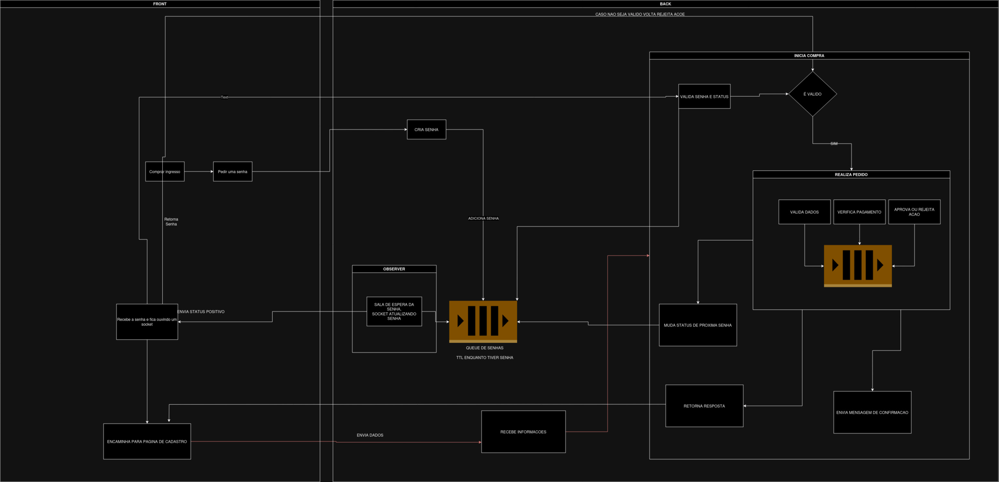
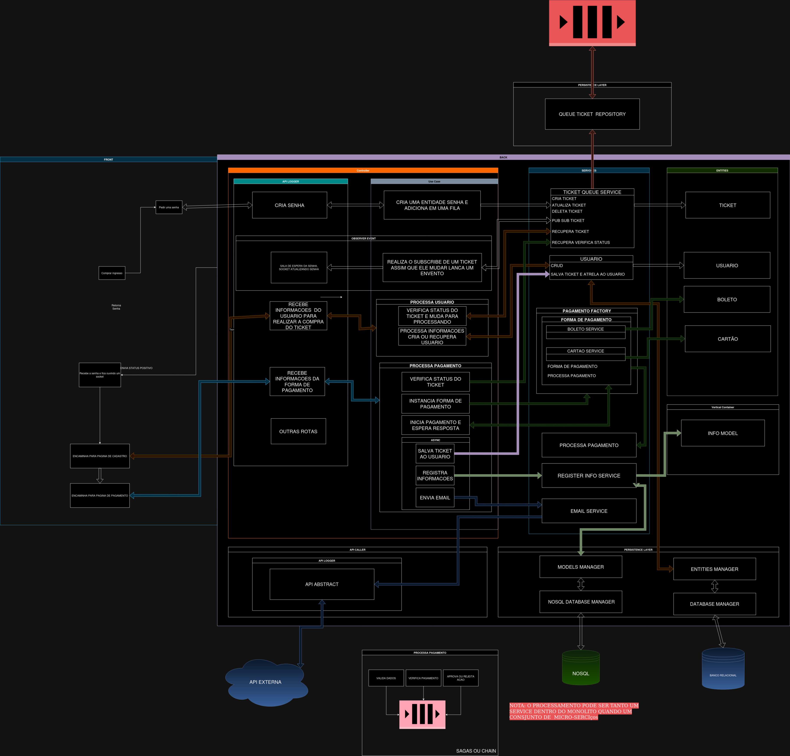

# ingressos-arq

## Cenário
Imagine que você é o(a) arquiteto(a) responsável pelo desenho de um sistema de logins para um site extremamente concorrido de ingressos de um mega show de Rock em Rio (got it?). Dado que o número de ingressos é limitado e muito inferior a quantidade de acessos no dia venda, você precisa garantir que o site só irá finalizar a venda para pessoas que realmente vão receber o ingresso, ou seja, você não pode deixar uma pessoa comprar um ingresso sem que haja mais disponíveis. Além disso, um cliente com internet mais lenta não ficaria feliz de não conseguir comprar seu ingresso pois uma pessoa com internet mais veloz passou sua frente.

### Arquitetura simplificada

Neste diagrama, a concepção visa a criação de uma arquitetura simplificada com o objetivo de representar um fluxo de interações mais técnico. O usuário inicia o processo solicitando uma senha, que é associada ao status "Aguardando". Essa senha permanece em espera até ser invocada, momento em que o status é alterado para "Processando". Neste ponto, o usuário registra seus dados para concluir uma compra. O processo de compra pode ser implementado como um micro-serviço separado, sendo executado e, ao término, retorna muda status do ticket para concluido e envia o status da compra.

### Arquitetura de entidades
Neste diagrama, são representadas as diferentes camadas, cada uma com sua função específica:

- Controller: Esta camada recebe as informações e as manipula para a próxima etapa do processo
- UseCase: Aqui, é implementado um padrão de adaptador que executa uma sequência de métodos necessários.
- Services: Nesta camada, encontram-se as implementações ou manipulações de entidades. Por exemplo, a inclusão de usuários em uma lista, recuperação de informações de usuários e a associação de tickets, entre outras operações.
- Entity: A camada de entidade é onde as regras de negócios são definidas. Isso inclui a geração de hashes para senhas, IDs de pagamento, cálculo de taxas para transações e a atualização de status.
- Persistence Layer: Aqui, a comunicação com o banco de dados é realizada, garantindo a persistência dos dados.
- API Caller: Nesta camada, é fornecida uma abstração para efetuar chamadas externas, que podem ser realizadas seguindo padrões como REST, gRPC, entre outros.
- API Logger: Trata-se de um middleware criado para registrar as entradas e saídas do programa, permitindo o monitoramento e auditoria das operações.

Observação 1: Este diagrama simplifica a arquitetura e não aborda questões relacionadas a herança, interfaces ou middlewares.

Observação 2: Middlewares como CORS, logs, controle de origem cruzada (cross-origin), autentição, ou validação de token, não estão representados no diagrama.

